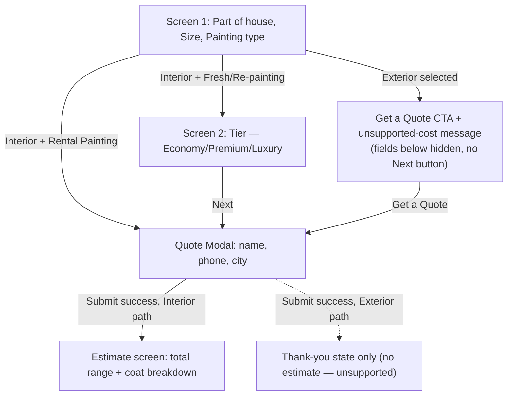

# Painting Cost Calculator — Spec

Status: Ready for implementation
Route: `apps/web/app/[locale]/painting-cost-calculator` (currently a stub — [page.tsx](../../apps/web/app/%5Blocale%5D/painting-cost-calculator/page.tsx))

## 1. Overview

A multi-step, client-side calculator that gives a prospective customer an approximate cost range for painting their home, then converts them into a lead by requiring contact details before the estimate is revealed.

## 2. Goals / Non-goals

- **Goal:** Estimate cost for **interior** painting only, across 3 painting types and 3 quality tiers.
- **Non-goal:** Exterior painting is never calculated. It is priced too variably (scaffolding, weather-grade paint, etc.) — the flow deliberately short-circuits to a manual quote request instead.

## 3. Flow overview



Everything happens as steps within a single page/component (client-side state machine) — there is no route change between steps. The quote modal is an overlay on top of the current step.

## 4. Screen 1

### 4.1 Field 1 — "Which part do you wish to paint?"

- Two selectable options, rendered as icon + label cards/toggles:
  - **Interior** — icon: `RockingChair` (lucide-react)
  - **Exterior** — icon: `TentTree` (lucide-react)
- Tooltip/info copy:
  - Interior: "Painting only the walls accessible from the interior of the house using simple ladder/stool."
  - Exterior: "Painting exterior walls of the house using custom scaffolding arrangement as the situation demands."
- **Behavior:**
  - Selecting **Interior**: option becomes selected, rest of Screen 1 behaves normally.
  - Selecting **Exterior**: all fields below (House Size, Type of Painting) and the Next button are hidden. In their place, show:
    - Message: *"Exterior painting costs varies significantly by the amount of scaffolding required, weather-grade paint and other factors. Request a quote to get exact cost."*
    - A **"Get a Quote"** button, which opens the Quote Modal (`source: "Calculator"`, see [§6](#6-lead-capture--quote-modal)) directly — no cost calculation, no Screen 2, no estimate screen. On successful submit, the modal's existing thank-you/success toast is the end state — nothing further to show.

### 4.2 Field 2 — House Size

- Options: **1 BHK | 2 BHK | 3 BHK | 4 BHK+**
- Below the selector, a 2-line explainer:
  > Typically, a *{size}* BHK has a carpet area of *{range}* sq.ft. If yours doesn't fall in this range, click here.

  | Size | Carpet area range |
  |---|---|
  | 1 BHK | 400–800 sq.ft. |
  | 2 BHK | 700–1000 sq.ft. |
  | 3 BHK | 900–1500 sq.ft. |
  | 4 BHK+ | 1400–2000 sq.ft. |

- "click here" is an inline text link. Clicking it reveals an **"Enter Carpet Area (sq.ft.)"** input — that string is placeholder text inside the input, not a `<label>`.
- Once revealed, the custom carpet-area input stays visible (does not re-hide on its own).
- **Validation:** integers only, range **100–4000 sq.ft.** Inline error if outside this range or non-integer.
- The BHK selector remains selected/interactive regardless of whether a custom area is entered — e.g. a user can pick "2 BHK" and still enter 1500 or 2000 sq.ft. as their actual carpet area. Both values are retained: the BHK bucket is kept for lead-data purposes (§8.6), but **cost is calculated from the custom value whenever one is entered** ([§8.1](#81-carpet-area-resolution)), overriding the BHK-bucket default.

### 4.3 Field 3 — Type of Painting

- Options, each with sub-text and a tooltip/info:

  | Option | Sub-text | Tooltip / info |
  |---|---|---|
  | Fresh Painting | "Painting your walls from scratch?" | Putty – 2 coats; Primer – 1 coat; Paint – 2 coats |
  | Re-painting | "Just looking to change the colors and finish of your walls?" | Primer – 1 coat; Paint – 2 coats |
  | Rental Painting | "Is your tenant vacating?" | Paint – 2 coats |

### 4.4 Navigation

- **Next** button at the bottom (hidden entirely when Exterior is selected — see 4.1).
- If **Rental Painting** is selected: the button stays labeled **"Next"**, but functionally skips Screen 2 (no tier applies to rental pricing) and goes straight to the Quote Modal.
- Otherwise (Fresh Painting / Re-painting): Next advances to Screen 2.

## 5. Screen 2 — Preference (skipped for Rental Painting)

Three tier cards. Each card lists 3 feature lines, each prefixed with a fixed icon (icon meaning stays the same across tiers — only the value changes):

- `Sparkles` — finish type
- `Droplets` — washability
- `BicepsFlexed` — durability

| Tier | Sub-text | Finish (`Sparkles`) | Washability (`Droplets`) | Durability (`BicepsFlexed`) |
|---|---|---|---|---|
| Economy | "I'm looking for budget-friendly painting without compromising on the quality!" | Matt Finish | Non-Washable | Upto 2 years |
| Premium | "I want my walls to have a classy and elegant feel!" | Matt & Sheen Finish | Semi-Washable | Upto 5 years |
| Luxury | "I want my walls to look exquisite and royal, much to my friends' envy!" | Matt & Sheen Finish | Fully-Washable | Upto 7 years |

Buttons: **Previous** (returns to Screen 1, selections retained), **Next** (opens the Quote Modal; on successful submission, advances to the Estimate screen).

## 6. Lead capture — Quote Modal

Reuses the existing [`QuoteModal`](../../apps/web/app/%5Blocale%5D/components/quote-modal/index.tsx) component (name / phone / city, honeypot field, submits via [`submitQuote`](../../apps/web/app/%5Blocale%5D/actions/submit-quote.tsx) → `@repo/google-sheets`).

**Ordering:** the modal is shown *before* the estimate is revealed — the user must submit contact details to unlock their result. This applies to every entry into the modal from this flow (Fresh/Re-painting via Screen 2, Rental via Screen 1 shortcut). The Exterior path also opens this same modal, but since there's no calculable estimate, submission just ends in the modal's existing thank-you/success toast — no estimate screen follows.

**Extended submission payload — applies site-wide, not just the calculator:** every "Get a Quote" entry point on the site now passes its own `source` value into the modal, so `QuoteModal`'s `source` prop becomes **required** (no default). `data` stays optional — only entry points that have structured context to attach pass it.

| Entry point | File | `source` | `data` |
|---|---|---|---|
| Header nav CTA (desktop + mobile) | `apps/web/app/[locale]/components/header/index.tsx` | `"Header"` | — |
| Hero CTA | `apps/web/app/[locale]/(home)/components/hero.tsx` | `"Hero"` | — |
| Calculator (Screen 2 Next / Rental shortcut / Exterior CTA) | `apps/web/app/[locale]/painting-cost-calculator/` | `"Calculator"` | JSON string, schema in [§8.6](#86-data-payload-shape) |

This requires:
- `QuoteRequest` (in `packages/google-sheets/index.ts`) to accept a required `source` field and an optional `data` field.
- `submitQuote` (in `apps/web/app/[locale]/actions/submit-quote.tsx`) and its zod schema to accept `source` (required) and `data` (optional).
- `QuoteModal` to accept a required `source` prop and optional `data` prop, forwarding both to `submitQuote`.
- Existing `QuoteModal` call sites (header, hero) updated to pass their `source` literal.
- The Google Apps Script backing the sheet (outside this repo) to append `Source` and `Data` columns and write these two new fields — **cross-team dependency, not implementable from this repo alone.**

## 7. Estimate screen

Shown after a successful Quote Modal submission (Interior paths only).

- **Total estimate**, shown as a range, e.g. `₹84,000 – ₹1,36,500`.
- **Carpet Area** and **Paintable Area** (× 3.5), shown above the breakdown table, not as rows inside it — e.g. `Carpet Area: 1,000 sq.ft.` · `Paintable Area: 3,500 sq.ft.`
- **Coat-by-coat breakdown table** beneath that, each coat's own subtotal range, e.g.:

  | Coat | Rate (₹/sq.ft.) | Subtotal |
  |---|---|---|
  | Putty (2 coats) | 4 – 8 | ₹14,000 – ₹28,000 |
  | Primer (1 coat) | 2 – 3 | ₹7,000 – ₹10,500 |
  | Premium Emulsion (2 coats) | 18 – 28 | ₹63,000 – ₹98,000 |
  | **Total** | | **₹84,000 – ₹1,36,500** |

  (worked example: 2 BHK, Fresh Painting, Premium — full calc in [§8.4](#84-worked-examples))

## 8. Cost calculation logic

### 8.1 Carpet area resolution

- If the user entered a **custom carpet area**, use that value directly.
- Otherwise, use the **maximum** of the selected BHK bucket's range:

  | Size | Carpet area used (no custom entry) |
  |---|---|
  | 1 BHK | 800 sq.ft. |
  | 2 BHK | 1000 sq.ft. |
  | 3 BHK | 1500 sq.ft. |
  | 4 BHK+ | 2000 sq.ft. |

### 8.2 Paintable wall area

For all painting types:

```
paintable_area_sqft = carpet_area_sqft × 3.5
```

### 8.3 Pricing table

| Painting type | Coat | Tier | ₹ / sq.ft. |
|---|---|---|---|
| Rental Painting | Distemper (2 coats) | — (no tier) | 8 – 12 |
| Re-painting | Primer (1 coat) | — (fixed, all tiers) | 1.5 – 2.5 |
| Re-painting | Emulsion (2 coats) | Economy | 12 – 18 |
| Re-painting | Emulsion (2 coats) | Premium | 18 – 28 |
| Re-painting | Emulsion (2 coats) | Luxury | 28 – 45 |
| Fresh Painting | Putty (2 coats) | — (fixed, all tiers) | 4 – 8 |
| Fresh Painting | Primer (1 coat) | — (fixed, all tiers) | 2 – 3 |
| Fresh Painting | Emulsion (2 coats) | Economy | 12 – 18 |
| Fresh Painting | Emulsion (2 coats) | Premium | 18 – 28 |
| Fresh Painting | Emulsion (2 coats) | Luxury | 28 – 45 |

### 8.4 Formulas by painting type

Each coat's subtotal = `paintable_area_sqft × [rate_low, rate_high]`, then **rounded to the nearest ₹100**. Total = sum of the (rounded) coat subtotals, low+low and high+high.

- **Rental Painting:** `total = paintable_area × [8, 12]` (Distemper only)
- **Re-painting:** `total = paintable_area × ([1.5,2.5] + tier_emulsion_rate)`
- **Fresh Painting:** `total = paintable_area × ([4,8] + [2,3] + tier_emulsion_rate)`

### 8.5 Worked examples

**Example A — 2 BHK, Fresh Painting, Premium, no custom area:**
```
carpet_area   = 1000 sq.ft. (max of 700–1000)
paintable_area = 1000 × 3.5 = 3500 sq.ft.
Putty    = 3500 × [4,8]   = ₹14,000 – ₹28,000
Primer   = 3500 × [2,3]   = ₹7,000  – ₹10,500
Emulsion = 3500 × [18,28] = ₹63,000 – ₹98,000
Total                     = ₹84,000 – ₹1,36,500
```

**Example B — 1 BHK, Rental Painting, custom area 650 sq.ft.:**
```
carpet_area    = 650 sq.ft. (custom, overrides 400–800 default)
paintable_area = 650 × 3.5 = 2275 sq.ft.
Distemper = 2275 × [8,12] = ₹18,200 – ₹27,300
Total                     = ₹18,200 – ₹27,300
```

### 8.6 Data payload shape (`data` field, §6)

```jsonc
{
  "partOfHouse": "interior",               // "interior" | "exterior"
  "houseSize": "2",                        // "1" | "2" | "3" | "4+" | null
  "customCarpetAreaSqft": null,             // number | null
  "carpetAreaUsedSqft": 1000,               // resolved value actually used
  "paintableAreaSqft": 3500,
  "paintingType": "fresh",                  // "fresh" | "repainting" | "rental" | null
  "tier": "premium",                        // "economy" | "premium" | "luxury" | null
  "estimate": {
    "low": 84000,
    "high": 136500,
    "breakdown": [
      { "coat": "Putty", "coats": 2, "low": 14000, "high": 28000 },
      { "coat": "Primer", "coats": 1, "low": 7000, "high": 10500 },
      { "coat": "Premium Emulsion", "coats": 2, "low": 63000, "high": 98000 }
    ]
  }
}
```
For the Exterior path, only `partOfHouse: "exterior"` is populated; `paintingType`, `tier`, and `estimate` are `null`.

## 9. Out of scope

- Exterior cost calculation.
- Any payment/checkout flow — this is estimate + lead capture only.
- Multi-language copy (i18n keys should follow the existing `dictionary.web.*` pattern used by `QuoteModal`, but exact keys are not enumerated here).
